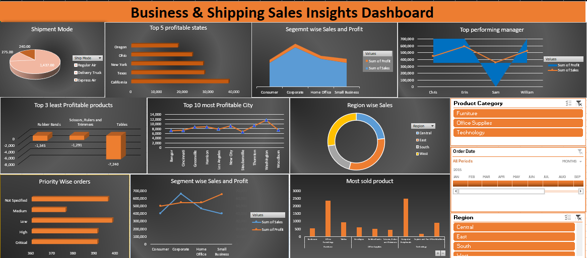

**📊 Project Title**     
Sales Performance Analysis Dashboard     

**📌 Short Description**
This interactive Excel dashboard provides a comprehensive overview of sales performance by analyzing shipment modes, top and least profitable products, regional sales trends, customer segments, manager performance, and product priorities.     

**⚙️ Tech Stats**        
**Tool Used:** Microsoft Excel    
**Visuals:** Pie charts, bar charts, line graphs, donut charts     
**Filters:** Product Category, Order Date, Region     
**Data Source:** Sales and profit data categorized by products, cities, states, regions, segments, and managers.        

**Features and Highlights**     
✅ Shipment mode distribution to understand logistics reliance.     
✅ Insights on top 5 profitable states and top 10 profitable cities.     
✅ Identification of top performing managers.     
✅ Priority-wise order breakdown for effective resource allocation.     
✅ Clear view of segment-wise sales and profit trends.     
✅ Region-wise sales distribution using a donut chart.     
✅ Highlights of most sold and least profitable products.     
✅ Interactive slicers for product category, order date, and region to enable dynamic analysis.     

**METRICS ANALYSED**     
**Shipment Mode:** Most shipments are by ‘Regular Air’ followed by ‘Delivery Truck’.     
**Top States:** California is the highest contributor to profit.     
**Least Profitable Products:** ‘Tables’ have significant negative profit.     
**Most Profitable Cities:** New York and Los Angeles stand out for high profitability.     
**Segment Performance:** Corporate segment drives highest sales and profit, while Small Business lags.     
**Top Performing Manager:** William generates high sales and profit, whereas Sam shows negative profit impact despite sales volume.     
**Region-wise Sales:** West region dominates in sales contribution.     
**Most Sold Product:** Binders are the most frequently sold item.     

**✅ Conclusion**
This Excel dashboard effectively uncovers sales strengths and inefficiencies within different regions, product lines, customer segments, and management performance. It enables stakeholders to make informed decisions about resource allocation, shipment planning, product focus, and managerial support to optimize overall profitability. 

